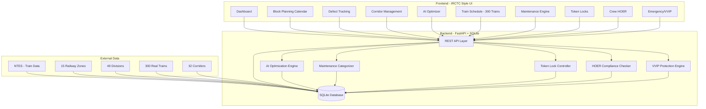
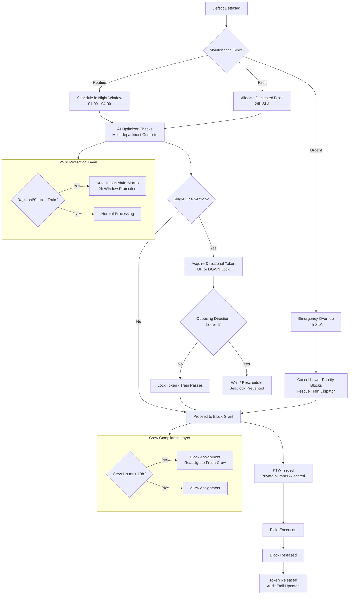
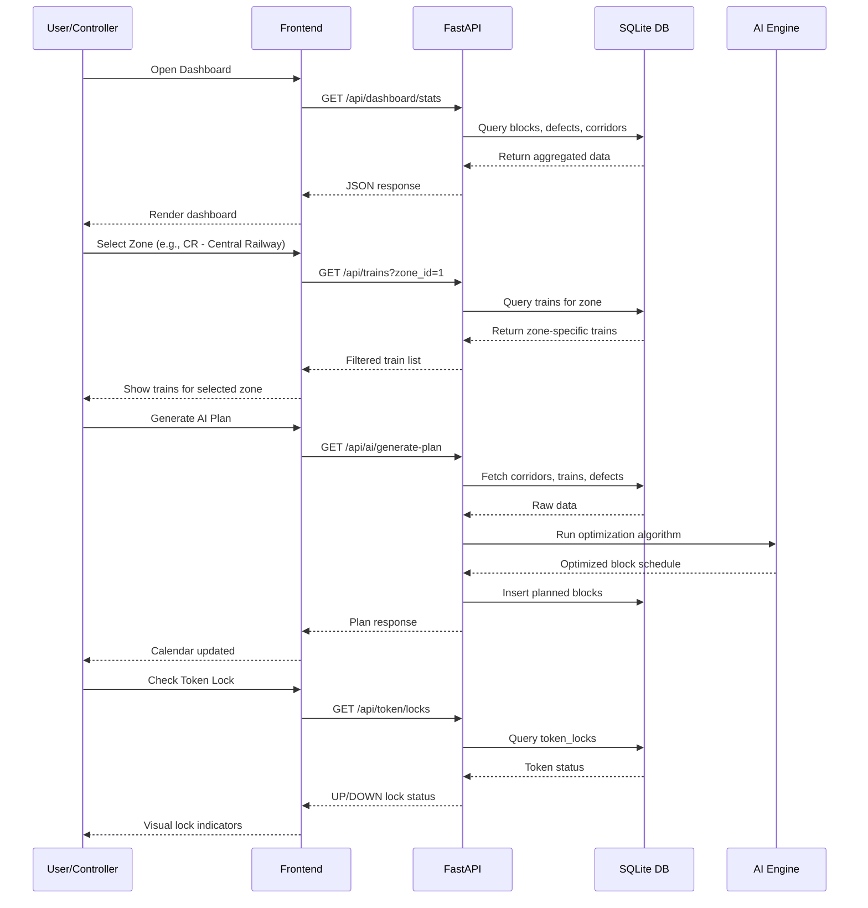

# RailBlock AI - Automatic Block Planning for Indian Railways

**SIH 2026 Problem Statement #26027** | Ministry of Railways | Category: Software

AI-Powered Automatic Block Planning system that automates maintenance block scheduling, optimizes multi-department coordination, and ensures safety compliance across Indian Railway networks.

## Problem
Indian Railways manages 131,000+ km of track with thousands of daily maintenance blocks. Current planning is manual, phone-based, and causes:
- Blocks treated as "favors" instead of entitlements
- No audit trail of block refusals
- Same time slot sold twice (trains + corridors)
- Safety incidents from delayed maintenance (Kanchanjunga, Khatauli)

## Solution
RailBlock AI automates the entire block planning lifecycle using real Indian Railway data.

### Core Features
- **Block Planning Calendar** - AI-generated weekly block schedules across 15 zones
- **Defect Tracking** - Priority-based defect management (critical/high/medium/low)
- **Corridor Management** - 32 corridors across India with single-line detection
- **AI Optimizer** - ML-based optimization for downtime reduction

### Advanced Systems
- **Maintenance Engine** - Categorizes defects as Routine (168h SLA), Fault (24h SLA), or Urgent (4h emergency override)
- **Directional Token Locks** - Prevents head-on deadlocks on single-line sections by enforcing mutual exclusion of UP/DOWN tokens
- **HOER Crew Compliance** - Non-linear penalty engine ensuring crew don't exceed 10-hour duty limits, with automatic reassignment alerts
- **VVIP & Emergency Protocols** - Auto-protects Rajdhani/special trains through maintenance corridors, triggers critical pushes after 11-hour delays

## Real Data
- **300 real trains** from Indian Railways (sourced from public NTES dataset covering 11,113 unique trains)
- **15 railway zones** across India (CR, WR, NR, ER, SR, SCR, NCR, NWR, NER, NFR, ECR, ECoR, SECR, SWR, WCR)
- **49 divisions** with headquarters
- **32 corridors** with real route names and distances

## Tech Stack
- **Backend**: Python 3.13, FastAPI, SQLite
- **Frontend**: Vanilla JS, Inter font, Font Awesome icons
- **Theme**: White IRCTC/government style, no dark navy, professional typography

## Quick Start
```bash
# Install dependencies
pip install fastapi uvicorn

# Seed database with real Indian Railway data
python seed_db.py

# Run server
python -m uvicorn backend.main:app --host 0.0.0.0 --port 8000

# Open browser
http://localhost:8000
```

## Project Structure
```
sih-railways/
├── backend/
│   └── main.py          # FastAPI application (all endpoints)
├── frontend/
│   ├── index.html       # IRCTC-style main dashboard
│   └── admin.html       # Admin panel
├── presentation/
│   └── SIH26027_RailBlockAI_FILLED.pptx
├── seed_db.py           # Database seeder (real train data)
├── real_trains.json     # 300 real Indian Railway trains
├── download_trains.py   # Data processing script
├── railblock.db         # SQLite database (auto-created)
└── README.md
```

## API Endpoints
| Endpoint | Method | Description |
|----------|--------|-------------|
| `/api/auth/login` | POST | User authentication |
| `/api/auth/register` | POST | Create user (admin only) |
| `/api/dashboard/stats` | GET | Dashboard KPIs |
| `/api/zones` | GET | All 15 railway zones |
| `/api/divisions` | GET | Divisions (filter by zone) |
| `/api/corridors` | GET | Corridor management |
| `/api/trains` | GET | Train schedule (300+ trains) |
| `/api/blocks` | GET | Block planning |
| `/api/defects` | GET | Defect list with filters |
| `/api/maintenance/engine` | GET | Maintenance categories & rules |
| `/api/token/locks` | GET | Directional token lock status |
| `/api/crew/duty` | GET | Crew HOER compliance |
| `/api/emergency/pushes` | GET | Emergency push history |
| `/api/emergency/vvip-status` | GET | VVIP protection rules |
| `/api/ai/optimize` | GET | Run AI optimization |
| `/api/ai/generate-plan` | GET | Generate weekly block plan |
| `/api/admin/*` | GET/POST/PUT/DELETE | Admin CRUD operations |

## System Architecture



## Block Planning Workflow



## Data Flow Diagram



## Credentials
- **Admin**: admin / admin123
- **Controller**: controller / ctrl123
- **Engineer**: engineer / eng123

## License
MIT License - SIH 2026 Submission
