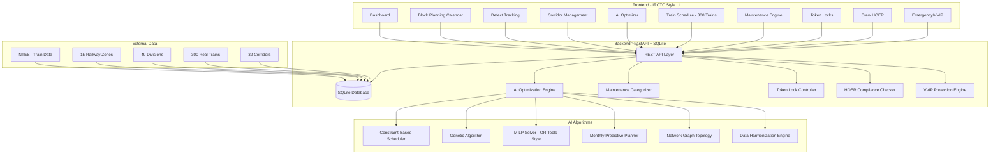
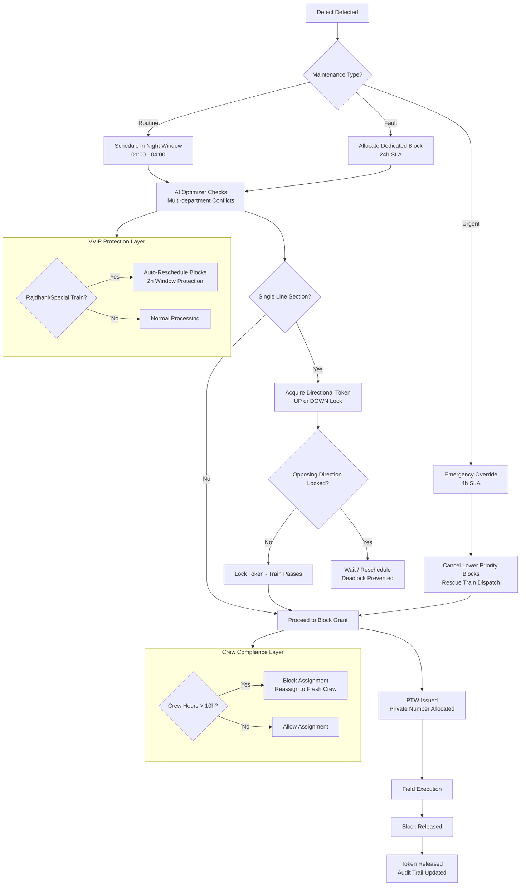
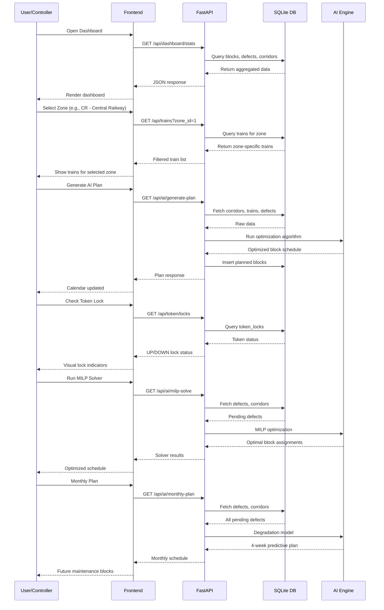

# Yantra - Automatic Block Planning for Indian Railways

**SIH 2026 Problem Statement #26027** | Ministry of Railways | Category: Software

AI-Powered Automatic Block Planning system that automates maintenance block scheduling, optimizes multi-department coordination, and ensures safety compliance across Indian Railway networks.

## Live Demo

| Component | URL |
|-----------|-----|
| **Frontend** | https://sih-railways.vercel.app |
| **Admin Panel** | https://sih-railways.vercel.app/admin.html |
| **Backend API** | https://railblock-ai-k8xm.onrender.com |

**Credentials:**
- Admin: `admin` / `admin123`
- Controller: `controller` / `ctrl123`
- Engineer: `engineer` / `eng123`

## Problem
Indian Railways manages 131,000+ km of track with thousands of daily maintenance blocks. Current planning is manual, phone-based, and causes:
- Blocks treated as "favors" instead of entitlements
- No audit trail of block refusals
- Same time slot sold twice (trains + corridors)
- Safety incidents from delayed maintenance (Kanchanjunga, Khatauli)

## Solution
Yantra automates the entire block planning lifecycle using real Indian Railway data.

### Core Features
- **Block Planning Calendar** - AI-generated weekly block schedules across 15 zones
- **Defect Tracking** - Priority-based defect management (critical/high/medium/low)
- **Corridor Management** - 32 corridors across India with single-line detection
- **AI Optimizer** - ML-based optimization for downtime reduction

### Advanced Systems
- **Maintenance Engine** - Categorizes defects as Routine (168h SLA), Fault (24h SLA), or Urgent (4h emergency override)
- **Directional Token Locks** - Prevents head-on deadlocks on single-line sections by enforcing mutual exclusion of UP/DOWN tokens
- **HOER Crew Compliance** - Non-linear penalty engine ensuring crew don't exceed 10-hour duty limits, with automatic reassignment alerts
- **VVIP & Emergency Protocols** - Auto-protects Rajdhani/special trains through maintenance corridors, triggers critical pushes after 11-hour delays

## Real Data
- **300 real trains** from Indian Railways (sourced from public NTES dataset covering 11,113 unique trains)
- **15 railway zones** across India (CR, WR, NR, ER, SR, SCR, NCR, NWR, NER, NFR, ECR, ECoR, SECR, SWR, WCR)
- **49 divisions** with headquarters
- **32 corridors** with real route names and distances
- **43 simulated defects** across 5 departments (TMS: 13 track defects, SMMS: 12 signal defects, TDMS: 15 traction defects, MCH: 3 mechanical, ELC: 3 electrical)
- **60 blocks** with realistic scheduling
- **11 crew members** with HOER compliance tracking
- **4 emergency pushes** including VVIP protection events

## Tech Stack
- **Backend**: Python 3.13, FastAPI, SQLite
- **Frontend**: Vanilla JS, Inter font, Font Awesome icons
- **Theme**: White IRCTC/government style, no dark navy, professional typography
- **Deployment**: Render (backend) + Vercel (frontend)

## Quick Start
```bash
# Install dependencies
pip install fastapi uvicorn

# Seed database with real Indian Railway data
python seed_db.py

# Run server
python -m uvicorn backend.main:app --host 0.0.0.0 --port 8000

# Open browser
http://localhost:8000
```

## Project Structure
```
sih-railways/
├── backend/
│   ├── main.py          # FastAPI application (all endpoints)
│   └── ai_engine.py     # AI optimization algorithms
├── frontend/
│   ├── index.html       # IRCTC-style main dashboard
│   └── admin.html       # Admin panel
├── presentation/
│   └── SIH26027_Yantra_FILLED.pptx
├── seed_db.py           # Database seeder (real train data)
├── real_trains.json     # 300 real Indian Railway trains
├── download_trains.py   # Data processing script
├── railblock.db         # SQLite database (auto-created)
└── README.md
```

## AI Algorithms Implemented

### 1. Constraint-Based Block Scheduler (CSP)
- Corridor conflict checking (no overlapping blocks on same corridor)
- Single-line section mutual exclusion (UP/DOWN tokens)
- VVIP protection windows (2h before/after Rajdhani/Shatabdi)
- Night window preference (01:00-04:00 for routine maintenance)
- Department workload balancing (max 2 concurrent blocks per dept)

### 2. Genetic Algorithm (GA)
- Population: 50, Generations: 100, Mutation: 0.15
- Multi-objective fitness: train disruption + night utilization + department balance + single-line safety
- Elitism with top 10% survival
- Tournament selection for parent choice

### 3. Mixed Integer Linear Programming (MILP) Solver
- OR-Tools style constraint programming formulation
- Decision variables: x[i,j,t] = 1 if block i assigned to corridor j at time t
- Constraints: corridor exclusivity, department limits, VVIP protection, single-line safety
- Greedy heuristic with constraint propagation for fast solving

### 4. Monthly Predictive Planning
- Asset degradation model: routine (0.5/week), fault (2.0/week), urgent (5.0/week)
- Projects critical defects 4 weeks ahead
- Generates weekly execution plans with block bundling
- Identifies mega-block opportunities (3+ defects in same corridor)

### 5. Network Graph Topology
- Node-edge graph representation of railway network
- BFS shortest path finding between stations
- Station connectivity analysis (major junctions)
- Single-line vs multi-line section classification

### 6. Data Harmonization & Priority Engine
- Normalizes multi-department data (TMS/SMMS/TDMS)
- Urgency scoring: critical=9, high=7, medium=5, low=3
- Type multiplier: urgent=1.5x, fault=1.2x, routine=1.0x
- Department summary with source system tracking

### 7. Conflict Detection & Resolution
- Block-train conflict detection (VVIP severity levels)
- Department overlap detection (same dept, same corridor)
- Single-line deadlock detection
- Scoring: train disruption (25%) + night utilization (20%) + VVIP protection (20%) + department balance (15%) + single-line safety (10%) + defect urgency (10%)

## API Endpoints

### Core Endpoints
| Endpoint | Method | Description |
|----------|--------|-------------|
| `/api/auth/login` | POST | User authentication |
| `/api/auth/register` | POST | Create user (admin only) |
| `/api/dashboard/stats` | GET | Dashboard KPIs |
| `/api/zones` | GET | All 15 railway zones |
| `/api/divisions` | GET | Divisions (filter by zone) |
| `/api/corridors` | GET | Corridor management |
| `/api/trains` | GET | Train schedule (300+ trains) |
| `/api/blocks` | GET | Block planning |
| `/api/defects` | GET | Defect list with filters |
| `/api/maintenance/engine` | GET | Maintenance categories & rules |
| `/api/token/locks` | GET | Directional token lock status |
| `/api/crew/duty` | GET | Crew HOER compliance |
| `/api/emergency/pushes` | GET | Emergency push history |
| `/api/emergency/vvip-status` | GET | VVIP protection rules |

### AI Endpoints
| Endpoint | Method | Description |
|----------|--------|-------------|
| `/api/ai/optimize` | GET | Run AI optimization (conflict + scoring) |
| `/api/ai/generate-plan` | GET | Generate weekly block plan (GA) |
| `/api/ai/conflicts` | GET | Get all detected conflicts |
| `/api/ai/score` | GET | Get multi-factor schedule score |
| `/api/ai/milp-solve` | GET | Run MILP solver (OR-Tools style) |
| `/api/ai/monthly-plan` | GET | Generate monthly predictive plan |
| `/api/ai/network-graph` | GET | Get network graph topology |
| `/api/ai/network-path` | GET | Find shortest path between stations |
| `/api/ai/harmonize` | GET | Run data harmonization (TMS/SMMS/TDMS) |

### Admin Endpoints
| Endpoint | Method | Description |
|----------|--------|-------------|
| `/api/admin/stats` | GET | Admin dashboard stats |
| `/api/admin/users` | GET | List all users |
| `/api/admin/blocks` | GET | List all blocks |
| `/api/admin/blocks` | POST | Create block |
| `/api/admin/blocks/{id}` | PUT | Update block status |
| `/api/admin/defects` | GET | List all defects |
| `/api/admin/defects` | POST | Create defect |
| `/api/admin/corridors` | GET | List all corridors |
| `/api/admin/corridors` | POST | Create corridor |

## System Architecture



## Block Planning Workflow



## Data Flow Diagram



## License
MIT License - SIH 2026 Submission
