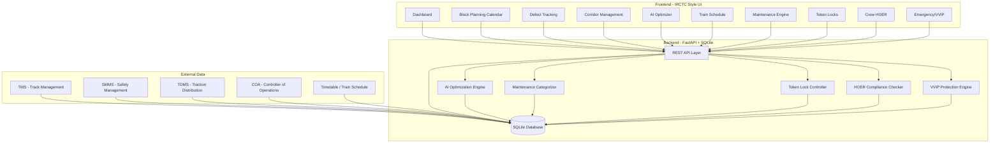
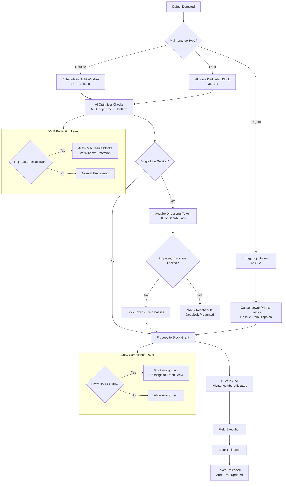
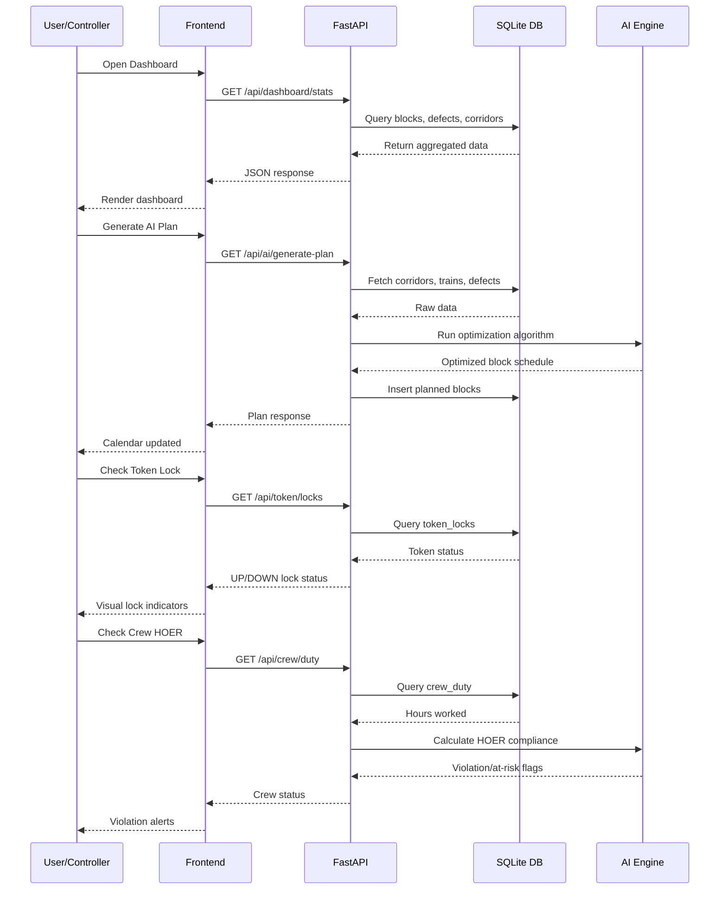

# RailBlock AI - Automatic Block Planning for Indian Railways

**SIH 2026 Problem Statement #26027** | Ministry of Railways | Category: Software

AI-Powered Automatic Block Planning system that automates maintenance block scheduling, optimizes multi-department coordination, and ensures safety compliance across Indian Railway networks.

## Problem
Indian Railways manages 131,000+ km of track with thousands of daily maintenance blocks. Current planning is manual, phone-based, and causes:
- Blocks treated as "favors" instead of entitlements
- No audit trail of block refusals
- Same time slot sold twice (trains + corridors)
- Safety incidents from delayed maintenance (Kanchanjunga, Khatauli)

## Solution
RailBlock AI automates the entire block planning lifecycle:

### Core Features
- **Block Planning Calendar** - AI-generated weekly block schedules
- **Defect Tracking** - Priority-based defect management (critical/high/medium/low)
- **Corridor Management** - Track utilization across 10 corridors
- **AI Optimizer** - ML-based optimization for downtime reduction

### Advanced Systems
- **Maintenance Engine** - Categorizes defects as Routine (168h SLA), Fault (24h SLA), or Urgent (4h emergency override)
- **Directional Token Locks** - Prevents head-on deadlocks on single-line sections by enforcing mutual exclusion of UP/DOWN tokens
- **HOER Crew Compliance** - Non-linear penalty engine ensuring crew don't exceed 10-hour duty limits, with automatic reassignment alerts
- **VVIP & Emergency Protocols** - Auto-protects Rajdhani/special trains through maintenance corridors, triggers critical pushes after 11-hour delays

## Tech Stack
- **Backend**: Python 3.13, FastAPI, SQLite
- **Frontend**: Vanilla JS, Inter font, Font Awesome icons
- **Theme**: White IRCTC/government style, no emojis, professional typography

## API Endpoints
| Endpoint | Method | Description |
|----------|--------|-------------|
| `/api/dashboard/stats` | GET | Dashboard KPIs |
| `/api/maintenance/engine` | GET | Maintenance categories & rules |
| `/api/token/locks` | GET | Directional token lock status |
| `/api/crew/duty` | GET | Crew HOER compliance |
| `/api/emergency/pushes` | GET | Emergency push history |
| `/api/emergency/vvip-status` | GET | VVIP protection rules |
| `/api/ai/optimize` | GET | Run AI optimization |
| `/api/ai/generate-plan` | GET | Generate weekly block plan |
| `/api/defects` | GET | Defect list with filters |
| `/api/blocks` | GET/POST | Block planning |
| `/api/corridors` | GET | Corridor management |
| `/api/trains` | GET | Train schedule (COA) |

## Quick Start
```bash
# Install dependencies
pip install fastapi uvicorn

# Run server
python run_server.py

# Open browser
http://localhost:8000
```

## Project Structure
```
sih-railways/
├── backend/
│   └── main.py          # FastAPI application (all endpoints)
├── frontend/
│   └── index.html       # IRCTC-style UI
├── presentation/
│   └── SIH26027_RailBlockAI_FILLED.pptx
├── run_server.py         # Server entry point
├── fill_template.py      # PPTX template filler
└── railblock.db          # SQLite database (auto-created)
```

## System Architecture



## Block Planning Workflow



## Data Flow Diagram



## License
SIH 2026 Submission
